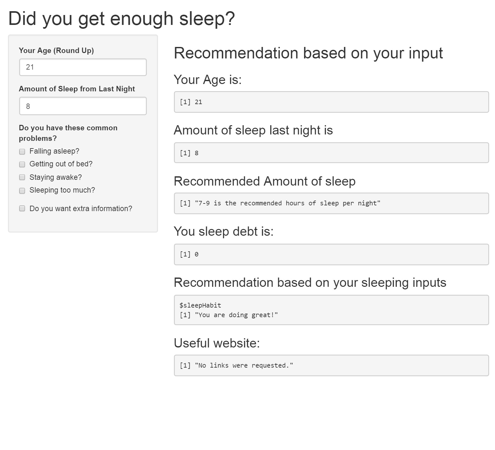
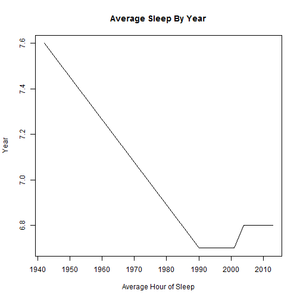

How Lack of Sleep is Bad
========================================================
author: Jacinto
date: April 01 2016
autosize: true

<small>
This is a project for Coursera Data Specalization Series
Assignment 1
</small>

About Shiny Sleep Calculator App
========================================================

Sleeping is very important to us. It determines the amount of energy we have in the day and how our mind works. And it also impacts our health. Yet we don't get enough sleep or get too much sleep. This leads to a vicious cycle where it continues to deplete our energy and health such that it gets harder and harder to get out. So I made to this app to help individuals to quickly determine if they are having the proper amount of sleep and getting help when they can. 

To access the app please go to <https://jchen3.shinyapps.io/Shiny_Assignment/>

How to use Shiny App
========================================================



***
In this shiny app you can input your age and how much sleep you had last night and it will calculate how much sleep you are lacking based on your age and give tips on getting better sleep.


Data on American Sleeping Habits
========================================================


```r
df <- read.csv("data/sleep_gallup.csv")
names(df) <- c("", "1942", "1990", "2001", "2004", "2013")
df
```

```
                           1942 1990 2001 2004 2013
1       Five hours or less  3.0 14.0 16.0 14.0 14.0
2                Six hours  8.0 28.0 27.0 26.0 26.0
3               Seve hours 25.0 30.0 28.0 28.0 25.0
4              Eight Hours 45.0 22.0 24.0 25.0 29.0
5       Nine Hours or more 14.0  5.0  4.0  6.0  5.0
6   Net: Six hours or less 11.0 42.0 43.0 40.0 40.0
7 Net: Seven hours or more 84.0 57.0 56.0 59.0 59.0
8  Average hours per night  7.6  6.7  6.7  6.8  6.8
```
<small>
This table show the percentage of american sleeping within a certain amount during each year. From the table it can be seen that American in general are sleeping a lot less than they are use to in the pass. 
</small>

Plot of American Average Sleep By Year
========================================================

***
There is a dramatic sleep declien from 1940 all the way to 2013. This show that American are sleeping a lot less than they use to. 

Useful links
========================================================

Data was obtain from Gallup. Link below
- http://goo.gl/e0NxEQ

Information used for the Shiny App
- https://goo.gl/h4uth0
- http://goo.gl/JUZEAu
- http://goo.gl/y54TmT
- https://goo.gl/9FBfGE
- http://goo.gl/OGTnsM

By no mean is this an extensive presentation on sleeping, but this should help you get started in becoming a sleeping mastering. Much to Learn You Still Have - Yoda
